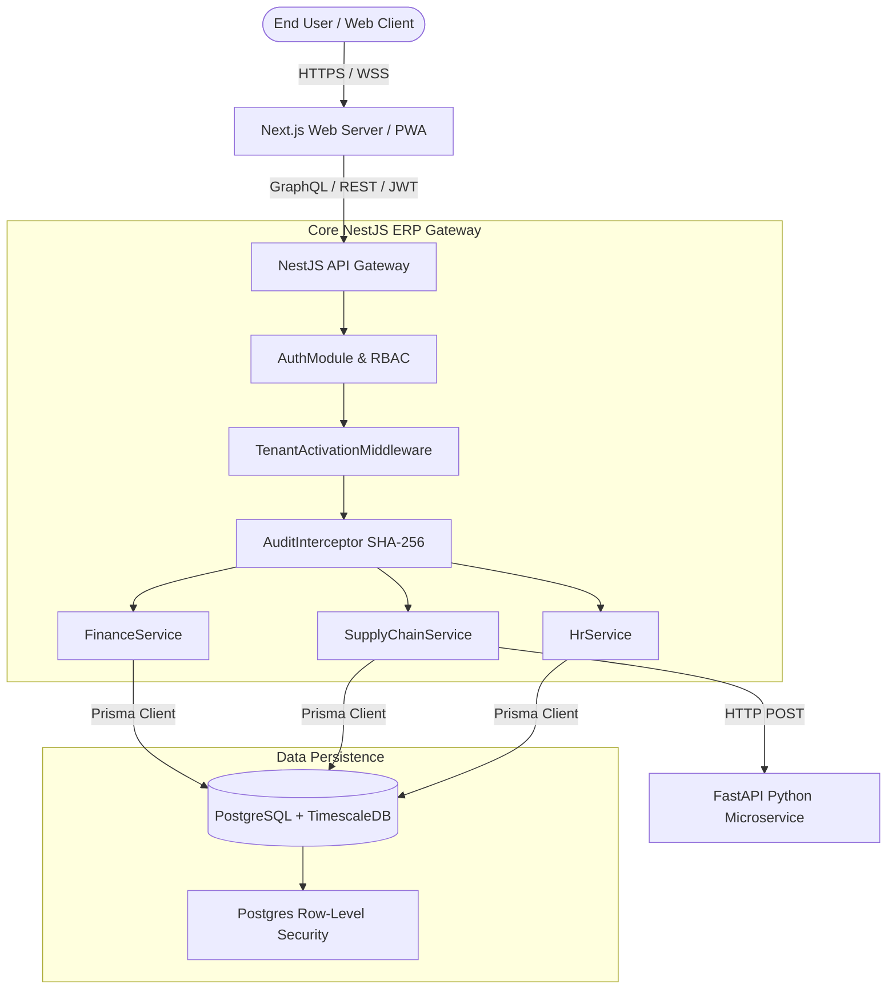

# Architecture Overview: Amdox AI Cloud ERP

Amdox AI Cloud ERP uses a strictly isolated, multi-tenant modular monolith architecture designed for enterprise-grade scalability, security, and auditing.

## High-Level System Architecture

## Security & Tenant Isolation

1. **Zero-Trust Boundaries**: Every API request must pass through `TenantMiddleware` and `TenantActivationMiddleware` which intercept the `x-tenant-id` header.
2. **Prisma RLS Extension**: Queries never manually inject `WHERE tenantId = ?`. Instead, the custom Prisma extension uses `set_config('app.current_tenant_id', ...)` and automatically scopes all `$allModels` reads/writes dynamically.
3. **Cryptographic Tamper Evidence**: The `AuditInterceptor` traps every `POST`, `PUT`, `DELETE` payload and constructs a chained SHA-256 hash. If any direct DB manipulation alters an audit log, the `verifyChainIntegrity` service will detect the mathematical corruption.

## AI Forecasting Flow

The NestJS `ForecastingService` bridges deterministic ERP logic with non-deterministic Machine Learning models:
- **Python ML Node**: A decoupled FastAPI Python service using Facebook Prophet.
- **Workflow**: Supply Chain Module gathers 90-day SKU movement history -> Sends to Python via HTTP -> Python trains model -> Python returns 30-day forecast -> NestJS renders to Frontend ECharts.

## Deployment Strategy
We utilize GitOps for CD:
- **ArgoCD**: Observes the `infra/k8s/argocd.yaml` manifest.
- **Helm**: Controls pod replication, env variables, and horizontal scaling.
- **Next-PWA**: Service workers cache the web client allowing offline read-access to critical reporting views.
